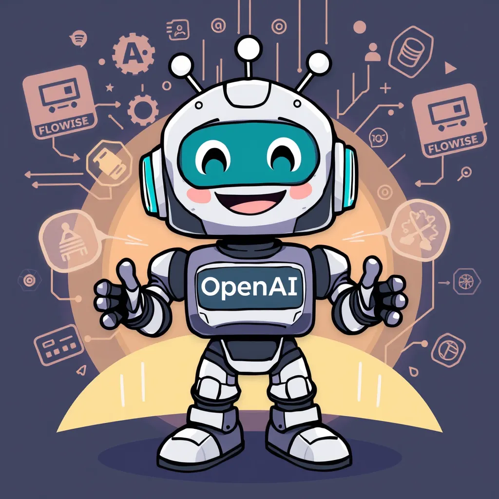

# Low-Code Website Sales Chatbot with GPT4o-mini and Flowise

A complete guide for settign up a low-cdoe sales chatbot featuring:
- AI sales assistant powered by GTP4o-mini API using Flowise
- Tutorial blog [here](https://www.gpt-labs.ai/post/how-to-build-a-low-code-ai-sales-chatbot-for-your-website-with-flowise-and-gpt-4o-mini-api)

## Features
- 🤖 AI sales assistant using ChatGPT 4o mini API and Flowise
- 📚 Complete implementation blog
- 🔍 RAG-based product search
- 💬 Natural conversation handling

## Quick Start
1. Clone the repository
2. Set up the website
3. Configure Flowise
4. Deploy the chatbot

## Setup Requirements
- Node.js
- Flowise
- Web site
- GPT4o-Mini API Key

## License
MIT License
